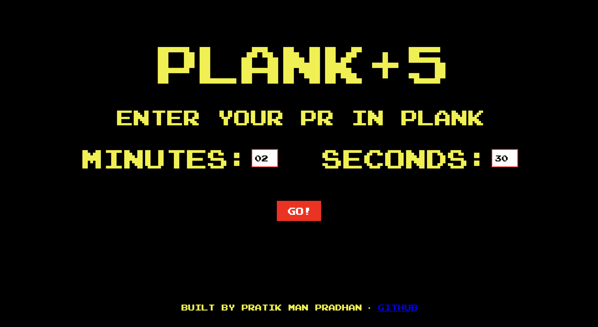
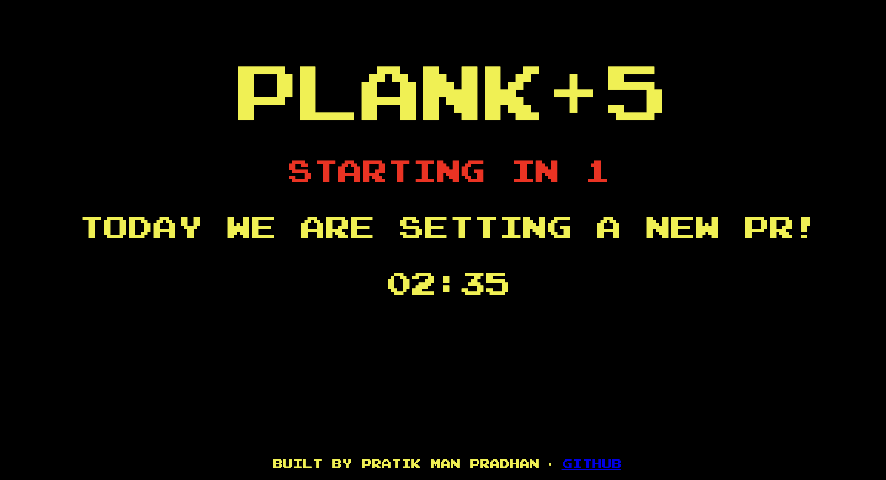
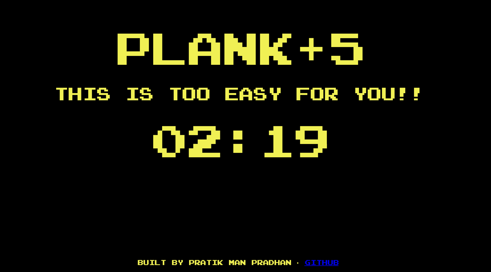
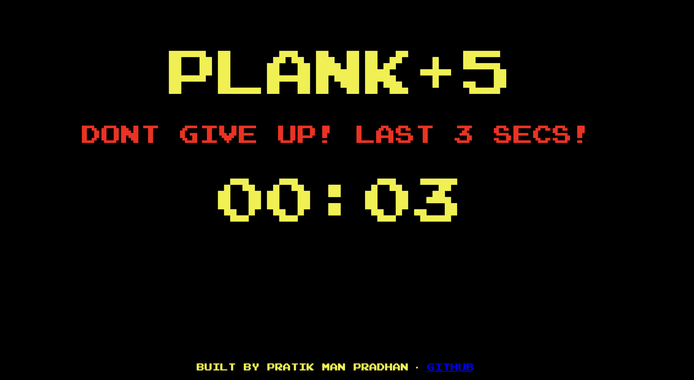
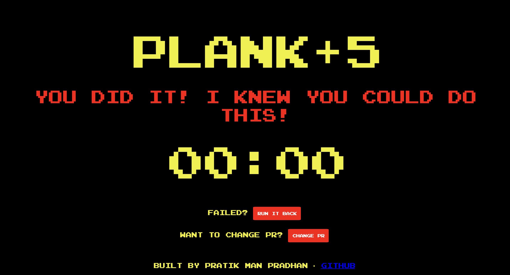

# Plank+5

**Plank+5** is a motivational plank countdown timer that pushes you to go just 5 seconds beyond your personal record — encouraging small, consistent progress.

  
  
  
  


---

## Features

- Countdown timer with user input
- Adds 5 seconds automatically to your input time
- Sound effects: beep sound at the last 10 seconds
- Retro font and design for a fun UI
- Desktop-focused layout

---

## How to Run

1. **Clone the repo**:
   ```bash
   git clone https://github.com/pmprdhn/PlankPlus5.git
   cd PlankPlus5
   ```

2.	Open the project in your browser
Open the index.html file using any modern desktop browser (Chrome, Firefox, Edge, etc).
You can double-click the file or run:
   ```bash
   open index.html    # macOS
   start index.html   # Windows
   ```
